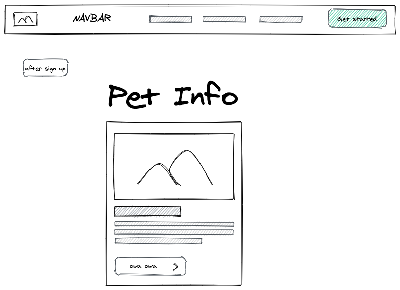

# Paw's Date
Paw's date is an app developed by a group of pet lovers who enjoy making new friends and would like to extend the same opportunity to their pets.
Create and account, add a little description about your pet, upload a profile picture and start matching!
Plus benefit: Great memory for the dog name but never remember the owner's? Use the app to remind yourslef!
#### TABLE OF CONTENTS
- [Installation](#Installation)
- [Screen-by-screen.design.layouts](#Screen-by-screen.design.layouts)
- [Usage](#Usage)
- [Credits](#Credits)
- [Badges](#Credits)
- [Contributors](#Contributors)
- [Future.Development](#Future.Development)
- [License](#License)
## Demo

## Installation
```
$npm i
```
## Screen-by-screen.design.layouts

## Usage
### Heroku Link
https://tranquil-beach-17376.herokuapp.com/
## Credits
1. React used as a base in the development of this application
2. Mongoose database used to house the data
3. GET and POST routes for retrieving and adding new data used to create the accounts for each user
4. Cloudinary used to house photos
5. Tailwind used for design
6. Deployed app is in Heroku
7. Oauth authentication is used to authenticate
8. Travis CI and ESLint are used to scan the quality of the code
9. Dashboard image credit to []()
10. Login page image credit to []()
## Badges
<br/>
 <br/>
 <br/>
## Contributors
[Jess Parnow](https://github.com/jessparnow)<br/>
[Somelina Obiechina](https://github.com/ifeasome) <br/>
[Mariam Ali](https://github.com/alimariam12) <br/>
[Romina Aguado](https://github.com/aguado-romina) <br/>
[Roxette Banos](https://github.com/chavelyo3) <br/>
## Future.Development
- Sound features as "barking" when you get a match<br/>
- Chat and sharing Imgs funtionality<br/>
- Dog parks searching capability supported by Google Maps<br/>
## License
[](https://opensource.org/licenses/MIT)
© 2021 Jess Parnow <br/>
© 2021 Somelina Obiechina <br/>
© 2021 Mariam Ali <br/>
© 2021 Romina Aguado <br/>
© 2021 Roxette Banos <br/>